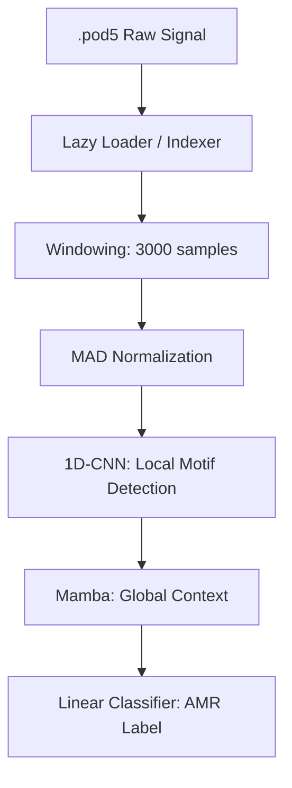

# The physics of the pore & the logic of Normalization.

A Nanopore signal $S(t)$ is a stochastic measurement of ionic current. Because flow cell conditions (buffer concentration, temperature) vary, raw values are useless for generalization.

1. The Superiority of MAD

We use Median Absolute Deviation (MAD) because it is a robust statistic. Unlike the Standard Deviation, which is sensitive to the extreme outliers (spikes) common in Nanopore data, MAD focuses on the central tendency of the signal.

  $$\hat{x}_i = \frac{x_i - \text{median}(x)}{\text{median}(|x_i - \text{median}(x)|) \times 1.4826}$$

The constant $1.4826$ is the scaling factor to make MAD a consistent estimator of the standard deviation for normally distributed data.

2. The Architectural Bridge: CNN-Mamba
To make this "feasible," we will employ a hybrid architecture.
   * 1D-CNN Front-end: Acts as a k-mer feature extractor ($3-5$ bp windows).
   * Mamba Block: Replaces or augments the LSTM/Transformer. It utilizes the Selective State Space ($S_6$) mechanism to selectively propagate or forget information  based on the input, which is critical for handling the variable translocation speed of DNA.

## Session Summary (08-04-2026)

### Progress:
- **Conceptualized Hybrid Architecture:** Decided on 1D-CNN + Mamba for $O(L)$ scaling and robust temporal variance handling.
- **Labeling Strategy:** Adopted the NanoResFormer (PMC12957220) approach—basecall a subset, align to AMR genes, and map back to signal coordinates.
- **Normalization:** Implemented a vectorized MAD normalization function in `src/utils/normalization.py`.

### Failures (The "Wall of Shame"):
- **Dataset Implementation:** The initial `src/data/dataset.py` was rejected due to:
    - Multiple syntax errors (`panda`, `unsqueze`, `sys.append.path`).
    - Inefficient O(N) indexing of POD5 files during initialization.
    - Type mismatches between NumPy (POD5) and PyTorch (Normalization).

### Data Pipeline Flow:

